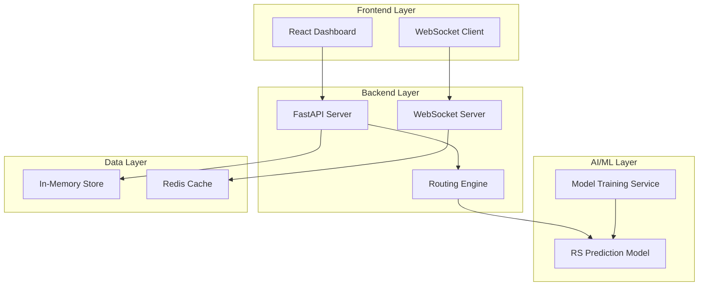

# Design Document

## Overview

The AI-Driven Smart Queue Routing System (SQRS) is designed as a modern, scalable web application that leverages machine learning to optimize customer-agent matching in real-time. The system follows a microservices-inspired architecture with clear separation between the presentation layer (React frontend), business logic layer (FastAPI backend), and the AI/ML engine.

The core innovation lies in the Routing Score (RS) calculation engine that uses gradient boosting to predict success probability between customer-agent pairs, enabling dynamic routing decisions that balance efficiency and customer satisfaction.

## Architecture

### High-Level Architecture



### Technology Stack

**Frontend:**
- React 18 with functional components and hooks
- TailwindCSS for styling and responsive design
- Recharts for analytics visualization
- Framer Motion for smooth animations
- WebSocket client for real-time updates

**Backend:**
- FastAPI (Python 3.9+) for high-performance API
- WebSocket support for real-time communication
- Pydantic for data validation and serialization
- CORS middleware for cross-origin requests

**AI/ML:**
- Scikit-learn for model training and inference
- XGBoost for gradient boosting implementation
- Pandas for data manipulation
- Joblib for model serialization

**Data Storage:**
- In-memory Python dictionaries for POC
- Redis for caching and session management
- Future: PostgreSQL for persistent storage

## Components and Interfaces

### Frontend Components

#### SmartQueueDashboard
Main container component that orchestrates the entire dashboard experience.

```typescript
interface DashboardProps {
  customers: Customer[]
  agents: Agent[]
  routingResults: RoutingResult[]
  systemStatus: 'connected' | 'offline' | 'error'
}
```

#### CustomerQueuePanel
Displays waiting customers with contextual information and priority indicators.

```typescript
interface Customer {
  id: string
  name: string
  sentiment: 'positive' | 'neutral' | 'negative'
  tier: 'premium' | 'standard' | 'basic'
  issueType: string
  issueComplexity: number
  channel: 'chat' | 'voice'
  waitTime: number
  priority: number
}
```

#### AgentPoolPanel
Shows available agents with their skills, experience, and current workload.

```typescript
interface Agent {
  id: string
  name: string
  specialty: string[]
  experience: number
  avgHandlingTime: number
  pastSuccessRate: number
  currentWorkload: number
  status: 'available' | 'busy' | 'offline'
  maxConcurrentCustomers: number
}
```

#### RoutingResultsPanel
Displays customer-agent matches with routing scores and reasoning.

```typescript
interface RoutingResult {
  customerId: string
  agentId: string
  routingScore: number
  timestamp: Date
  reasoning: string[]
  status: 'pending' | 'active' | 'completed'
}
```

#### AnalyticsChart
Visualizes routing performance metrics over time.

```typescript
interface AnalyticsData {
  timestamp: Date
  averageRS: number
  totalRoutings: number
  successRate: number
}
```

### Backend API Endpoints

#### Customer Management
```python
@app.get("/customers")
async def get_customers() -> List[Customer]:
    """Returns all customers currently in queue"""

@app.post("/customers")
async def add_customer(customer: CustomerCreate) -> Customer:
    """Adds a new customer to the queue"""

@app.delete("/customers/{customer_id}")
async def remove_customer(customer_id: str) -> dict:
    """Removes customer from queue"""
```

#### Agent Management
```python
@app.get("/agents")
async def get_agents() -> List[Agent]:
    """Returns all agents with current status"""

@app.put("/agents/{agent_id}/status")
async def update_agent_status(agent_id: str, status: AgentStatus) -> Agent:
    """Updates agent availability status"""
```

#### Routing Operations
```python
@app.post("/route")
async def auto_route() -> List[RoutingResult]:
    """Performs automatic routing for all queued customers"""

@app.post("/route/manual")
async def manual_route(assignment: ManualAssignment) -> RoutingResult:
    """Allows manual customer-agent assignment"""

@app.post("/route/reset")
async def reset_queue() -> dict:
    """Resets all assignments and returns customers to queue"""
```

#### Analytics
```python
@app.get("/analytics/performance")
async def get_performance_metrics(
    start_date: datetime, 
    end_date: datetime
) -> PerformanceMetrics:
    """Returns routing performance analytics"""
```

### AI/ML Components

#### RoutingScorePredictor
Core ML component that calculates success probability between customer-agent pairs.

```python
class RoutingScorePredictor:
    def __init__(self, model_path: str):
        self.model = joblib.load(model_path)
        self.feature_encoder = self._load_encoder()
    
    def predict_routing_score(
        self, 
        customer: Customer, 
        agent: Agent
    ) -> float:
        """Predicts success probability (0-1) for customer-agent pair"""
        features = self._encode_features(customer, agent)
        return self.model.predict_proba(features.reshape(1, -1))[0][1]
    
    def predict_batch(
        self, 
        customer_agent_pairs: List[Tuple[Customer, Agent]]
    ) -> List[float]:
        """Batch prediction for multiple pairs"""
```

#### RoutingEngine
Orchestrates the routing logic using ML predictions and business rules.

```python
class RoutingEngine:
    def __init__(self, predictor: RoutingScorePredictor):
        self.predictor = predictor
        self.tie_break_threshold = 0.03
    
    def route_customers(
        self, 
        customers: List[Customer], 
        agents: List[Agent]
    ) -> List[RoutingResult]:
        """Routes all customers to optimal agents"""
        
    def _calculate_routing_matrix(
        self, 
        customers: List[Customer], 
        agents: List[Agent]
    ) -> np.ndarray:
        """Calculates RS matrix for all customer-agent combinations"""
```

## Data Models

### Core Entities

#### Customer Data Model
```python
class Customer(BaseModel):
    id: str
    name: str
    sentiment: Literal['positive', 'neutral', 'negative']
    tier: Literal['premium', 'standard', 'basic']
    issue_type: str
    issue_complexity: float  # 0-1 scale
    channel: Literal['chat', 'voice']
    wait_time: int  # seconds
    priority: int  # 1-10 scale
    created_at: datetime
    context: Dict[str, Any]  # Additional metadata
```

#### Agent Data Model
```python
class Agent(BaseModel):
    id: str
    name: str
    specialty: List[str]
    experience: float  # years
    avg_handling_time: float  # minutes
    past_success_rate: float  # 0-1
    current_workload: int  # number of active customers
    max_concurrent: int
    status: Literal['available', 'busy', 'offline']
    skills: Dict[str, float]  # skill -> proficiency (0-1)
    last_updated: datetime
```

#### Routing Result Data Model
```python
class RoutingResult(BaseModel):
    id: str
    customer_id: str
    agent_id: str
    routing_score: float
    timestamp: datetime
    reasoning: List[str]
    status: Literal['pending', 'active', 'completed']
    feedback_score: Optional[float]  # Post-interaction feedback
    actual_handling_time: Optional[float]
    success_outcome: Optional[bool]
```

### ML Feature Schema

#### Training Data Schema
```python
class TrainingRecord(BaseModel):
    # Customer features
    customer_sentiment: int  # encoded: negative=0, neutral=1, positive=2
    customer_tier: int  # encoded: basic=0, standard=1, premium=2
    issue_complexity: float
    channel_type: int  # encoded: chat=0, voice=1
    
    # Agent features
    agent_experience: float
    agent_specialty_match: float  # 0-1 based on issue type match
    agent_past_success: float
    agent_avg_handling_time: float
    agent_current_workload: float  # normalized 0-1
    
    # Context features
    time_of_day: int  # hour 0-23
    day_of_week: int  # 0-6
    queue_length: int
    
    # Target
    success_label: int  # 0 or 1
```

## Error Handling

### Frontend Error Handling
- Network connectivity issues with automatic retry logic
- API timeout handling with user notifications
- WebSocket connection failures with reconnection attempts
- Invalid user input validation with clear error messages
- Graceful degradation when real-time features are unavailable

### Backend Error Handling
- ML model unavailability with fallback to rule-based routing
- Database connection failures with in-memory fallback
- Invalid request data with detailed validation errors
- Rate limiting for API endpoints
- Comprehensive logging for debugging and monitoring

### ML Model Error Handling
- Model prediction failures with confidence thresholds
- Feature encoding errors with default value handling
- Model performance degradation detection
- Automatic fallback to previous model version
- Data drift detection and alerting

## Testing Strategy

### Unit Testing
- **Frontend Components**: Jest and React Testing Library for component behavior
- **API Endpoints**: FastAPI TestClient for endpoint functionality
- **ML Components**: Pytest for model prediction accuracy and feature engineering
- **Routing Logic**: Comprehensive test cases for edge cases and business rules

### Integration Testing
- **API Integration**: End-to-end API workflow testing
- **WebSocket Communication**: Real-time update functionality
- **ML Pipeline**: Complete prediction pipeline from raw data to routing decisions
- **Database Operations**: Data persistence and retrieval accuracy

### Performance Testing
- **API Response Times**: Sub-200ms response time validation
- **ML Inference Speed**: Batch prediction performance under load
- **WebSocket Scalability**: Concurrent connection handling
- **Memory Usage**: Resource consumption monitoring

### User Acceptance Testing
- **Dashboard Usability**: Supervisor workflow validation
- **Routing Accuracy**: RS prediction quality assessment
- **Real-time Updates**: Live data synchronization verification
- **Error Recovery**: System resilience under failure conditions

### Test Data Strategy
- **Mock Data Generation**: Realistic customer and agent profiles
- **Scenario-based Testing**: Various routing complexity scenarios
- **Edge Case Coverage**: No agents available, equal RS scores, system overload
- **Performance Benchmarks**: Load testing with 100+ concurrent customers

The testing approach ensures reliability, performance, and user experience quality across all system components while maintaining the rapid development pace required for hackathon delivery.